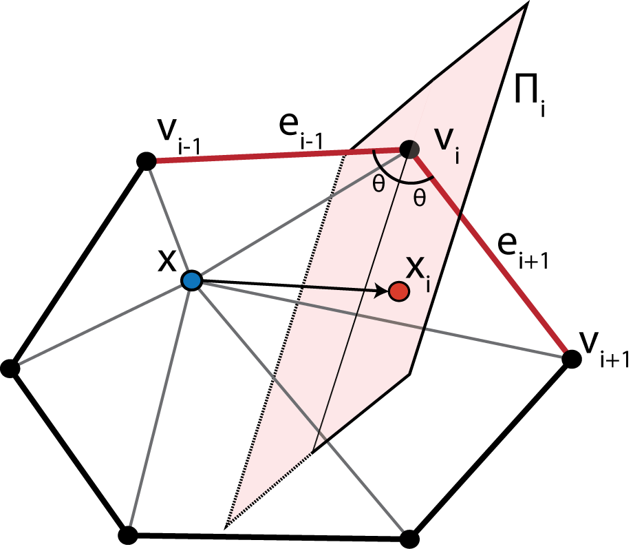
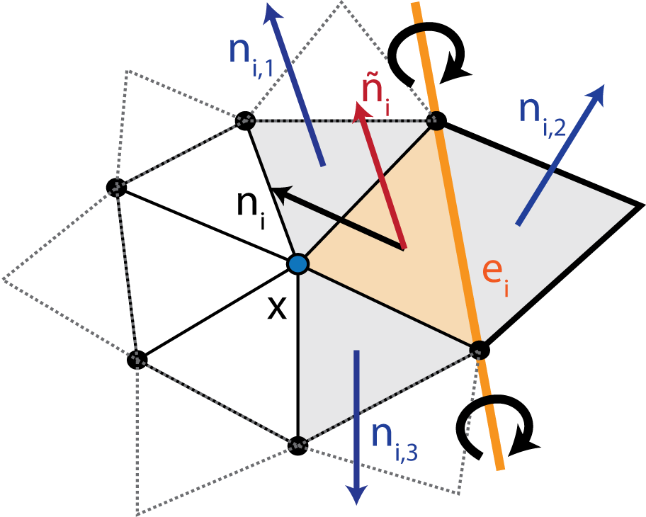

############################
Overview of GAMer Algorithms
############################

.. contents::
   :local:

.. _Local Structure Tensor:

****************************
Local Structure Tensor (LST)
****************************

To represent information about the local geometry, mesh processing operations in ``GAMer`` use a Local Structure Tensor (LST).
The LST is defined as follows,

.. math::
  T(\mathbf{v}) = \sum_{i=1}^{N_r} \mathbf{n_i}\otimes\mathbf{n_i}= \sum_{i=1}^{N_r}
  \begin{pmatrix}
    n_i^xn_i^x & n_i^xn_i^y & n_i^xn_i^z\\
    n_i^yn_i^x & n_i^yn_i^y & n_i^yn_i^z\\
    n_i^zn_i^x & n_i^zn_i^y & n_i^zn_i^z
  \end{pmatrix},

where :math:`\mathbf{v}` is the vertex of interest, :math:`N_r` is the number of neighbors in the :math:`r`-ring neighborhood, and :math:`n_{i}^{x,y,z}` form the normal of the :math:`i`-th neighbor vertex.
Vertex normals are defined as the weighted average of incident face normals.
Performing the eigendecomposition of the LST, we obtain information on the principal orientations of normals in the local neighborhood.
The magnitude of the eigenvalue corresponds to the amount of curvature along the direction of the corresponding eigenvector.
Inspecting the magnitude of the eigenvalues gives several geometric cases:

- Planes: :math:`\lambda_1 \gg \lambda_2 \approx \lambda_3 \approx 0`
- Ridges and valleys: :math:`\lambda_1 \approx \lambda_2 \gg \lambda_3 \approx 0`
- Spheres and saddles: :math:`\lambda_1 \approx \lambda_2 \approx \lambda_3 > 0`

.. _Weighted Vertex Smooth:

**********************
Weighted Vertex Smooth
**********************

The ``Smooth`` algorithm use an angle-weighted Laplacian smoothing approach, as shown in :numref:`fig_smooth`.

.. _fig_smooth:

   Illustration of the Weighted Vertex Smooth algorithm.
   In essence, this algorithm applies local torsion springs to the 1-ring neighborhood of a vertex of interest to balance the angles.

Given a vertex :math:`\mathbf{x}` with the set of 1-ring neighbors :math:`\{\mathbf{v}_1,\ldots,\mathbf{v}_N\}`, where :math:`N` is the number of neighbors, ordered such that :math:`\mathbf{v}_i` is connected to :math:`\mathbf{v}_{i-1}` and :math:`\mathbf{v}_{i+1}` by edges.
The 1-ring is connected such that :math:`\mathbf{v}_{N+1} := \mathbf{v}_1` and :math:`\mathbf{v}_{-1} := \mathbf{v}_N`.
Traversing the 1-ring neighbors, we define edge vectors
:math:`\mathbf{e}_{i-1} := \overrightarrow{\mathbf{v}_i\mathbf{v}_{i-1}}` and
:math:`\mathbf{e}_{i+1} := \overrightarrow{\mathbf{v}_i\mathbf{v}_{i+1}}`.
This algorithm seeks to move :math:`\mathbf{x}` to lie on the perpendicularly bisecting plane :math:`\Pi_i` of :math:`\angle(\mathbf{v}_{i-1}, \mathbf{v}_{i}, \mathbf{v}_{i+1})`.
For each vertex in the 1-ring neighbors, we compute the perpendicular projection, :math:`\mathbf{x}_i`, of :math:`\mathbf{x}` onto :math:`\Pi_i`.
Since small surface mesh angles are more sensitive to change in :math:`\mathbf{x}` position than large angles, we prioritize their maximization.
We define a weighting factor, :math:`\alpha_i = \frac{\mathbf{e}_{i-1}\cdot\mathbf{e}_{i+1}}{\lvert\mathbf{e}_{i-1}\rvert\cdot\lvert\mathbf{e}_{i+1}\rvert}`, which inversely corresponds with :math:`\angle(\mathbf{v}_{i-1}, \mathbf{v}_{i}, \mathbf{v}_{i+1})`.
The average of the projections weighted by :math:`\alpha_i` gives a new position of :math:`\mathbf{x}` as follows,

.. math::
   \bar{\mathbf{x}} = \frac{1}{\sum_{i=1}^{N}(\alpha_i + 1)}\sum_{i=1}^{N}(\alpha_i + 1)\mathbf{x}_i.

To maintain the fidelity of the local geometry we restrict vertex movement along directions of low curvature.
This constraint is achieved by anisotropically dampening vertex diffusion using information contained in the LST.
Computing the eigendecomposition of the LST, we obtain eigenvalues :math:`\lambda_1, \lambda_2, \lambda_3` and eigenvectors :math:`\mathbf{E}_1, \mathbf{E}_2, \mathbf{E}_3`, which correspond to principal orientations of local normals.
We project :math:`\bar{\mathbf{x}}-\mathbf{x}` onto the eigenvector basis and scale each component by the inverse of the corresponding eigenvalue,

.. math::
   \hat{\mathbf{x}} = \mathbf{x} + \sum_{k=1}^{3}\frac{1}{1+\lambda_k}[(\bar{\mathbf{x}}-\mathbf{x})\cdot \mathbf{E}_k]\mathbf{E}_k.

This has the effect of dampening movement along directions of high curvature i.e., where :math:`\lambda` is large.

.. _Mesh Decimation:

***************
Mesh Decimation
***************

Mesh coarsening/decimation algorithms in ``GAMer`` use a vertex removal based algorithm.
First, vertices are selected to be removed based upon some criteria, discussed below.
We then remove the vertex and re-triangulate the resulting hole.
This is achieved using a recursive triangulation approach, which heuristically balances the edge valency.
Given the boundary loop, we first connect vertices with the fewest incident edges.
This produces two resulting holes that we then fill recursively using the same approach.
When a hole contains only three boundary vertices, they are connected to make a face.
We note that while this triangulation scheme balances vertex valency, it may degrade mesh quality.
We solve this by using weighted vertex smooth on the local region.

We employ two criteria for selecting vertices to remove.
First, to selectively decimate vertices in low or high curvature regions, again information from the LST can be used.
By comparing the magnitudes of the eigenvalues of the LST we can select for regions with different geometries.
For example, to decimate vertices in flat regions of the mesh, given eigenvalues :math:`\lambda_1 \geq \lambda_2 \geq \lambda_3`, vertices can be selected by checking if the local region satisfies,

.. math::
   \frac{\lambda_2}{\lambda_1} < R_1,

where :math:`R_1` is a user specified flatness threshold (smaller is flatter).
In a similar fashion, vertices in curved regions can also be selected.
However, decimation of curved regions is typically avoided due to the potential for losing geometric information.

Instead, to simplify dense areas of the mesh, we employ an edge length based selection criterion,

 .. math::
    \frac{\mathrm{max}_{i=1}^{N_1}d(\mathbf{x}, \mathbf{v}_i)}{\overline{D}} < R_2,

where :math:`N_1` is the number of vertices in the 1-ring neighborhood of vertex :math:`\mathbf{x}`, :math:`d(\cdot,\cdot)` is the distance between vertices :math:`\mathbf{x}` and :math:`\mathbf{v}_i`, :math:`\overline{D}` is the mean edge length of the mesh, and :math:`R_2` is a user specified threshold.
This criterion allows us to control the sparseness of the mesh.

.. _Anisotropic Normal Smooth:

*************************
Anisotropic Normal Smooth
*************************

To produce smoothly varying normals across the mesh without compromising mesh angle quality we use an anisotropic normal smoothing algorithm shown in :numref:`fig_normalsmooth`.
Given a vertex :math:`\mathbf{x}` of interest, for each incident face :math:`i`, with normal :math:`\mathbf{n}_i` we rotate :math:`\mathbf{x}` around a rotation axis defined by opposing edge :math:`e_i` such that :math:`\mathbf{n}_i` aligns with the mean normal of neighboring faces :math:`\bar{\mathbf{n}_i} = \sum_{j=1}^{3} \mathbf{n}_{ij}/3`.
We denote the new position which aligns :math:`\mathbf{n}_i` and :math:`\bar{\mathbf{n}_i}` as :math:`R(\mathbf{x};e_i, \theta_i)`.
Summing up the rotations and weighting by incident face area, :math:`a_i`, we get an updated position,

.. math::
   \bar{\mathbf{x}} = \frac{1}{\sum_{i=1}^{N_1}a_i} \sum_{i=1}^{N_1}a_i R(\mathbf{x};e_i, \theta_i).

This is an isotropic scheme that is independent of the local geometric features;
meaning that many iterations of this algorithm may weaken sharp features.

.. _fig_normalsmooth:

   Illustration of the Anisotropic Normal Smooth algorithm.

Instead, we use an anisotropic scheme to compute the mean neighbor normals,

.. math::
   \bar{\mathbf{n}_i} = \frac{1}{\sum_{j=1}^{3} e^{K(\mathbf{n}_i\cdot \mathbf{n}_{ij})}} \sum_{j=1}^{3} e^{K(\mathbf{n}_i\cdot \mathbf{n}_{ij})} \mathbf{n}_{ij},

where :math:`K` is a user defined positive parameter which scales the extent of anisotropy.
Under this scheme, the weighting function decreases as a function of the angle between :math:`\mathbf{n}_i` and :math:`\mathbf{n}_{ij}` resulting in the preservation of sharp features.
