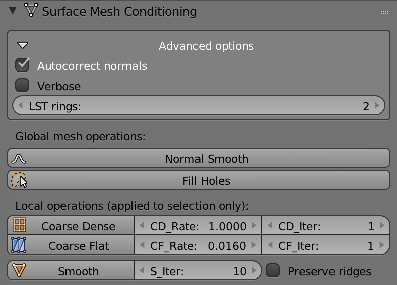
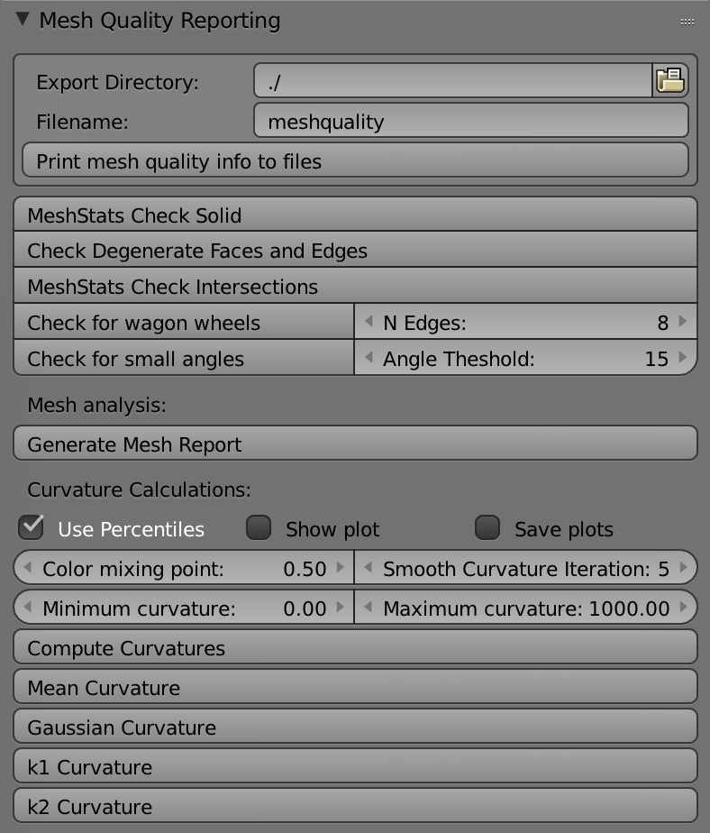
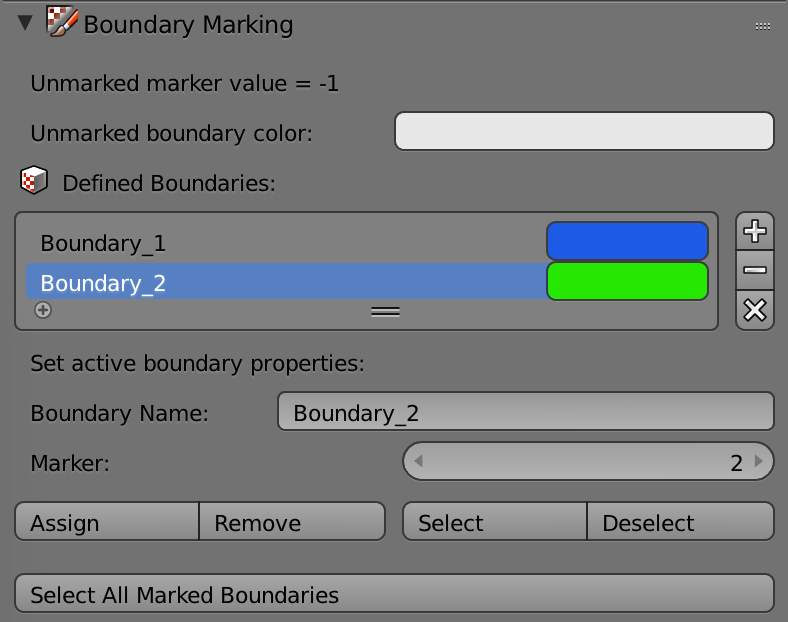
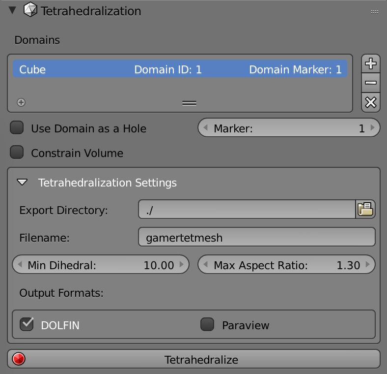

##########################
Getting to Know BlendGAMer
##########################

.. note::
   You can always hover your mouse over an button or option of interest and a pop-up will appear with a long description.

The ``BlendGAMer`` toolshelf contains for major menus:

- :ref:`Surface Mesh Conditioning Menu`
- :ref:`Mesh Quality Reporting Menu`
- :ref:`Boundary Marking Menu`
- :ref:`Tetrahedralization Menu`

.. _Surface Mesh Conditioning Menu:

******************************
Surface Mesh Conditioning Menu
******************************

.. _fig_surfacemeshconditioning:

   Snapshot of the Surface Mesh Conditioning menu in ``Blender``.

These operations apply to the whole mesh:

- **Normal Smooth**: Apply :ref:`Anisotropic Normal Smooth` to the mesh.

- **Fill Holes**: Triangulate holes in the mesh.

These operations are only available in **Edit Mode** and apply to selected vertices only:

- **Coarse Dense**: Apply ``CD_iter`` iterations of coarsening to dense regions of the mesh with threshold ``CD_Rate`` (:ref:`Mesh Decimation`).

- **Coarse Flat**: Apply ``CF_iter`` iterations of coarsening to flat regions of the mesh with threshold ``CF_Rate`` (:ref:`Mesh Decimation`).

- **Smooth**: Apply ``s_iter`` iterations of :ref:`Weighted Vertex Smooth` and Edge Flipping to smooth the mesh.
  - **Preserve Ridges**: Skip edge flips which occur along ridges of the mesh.

Advanced Options
================

- **Autocorrect normals**: Check to automatically flip the orientations of mesh normals if the volume is negative.

- **Verbose**: Whether or not operation should print to the console.

- **LST rings**: Integer neighborhood used to compute the :ref:`Local Structure Tensor`.

.. _Mesh Quality Reporting Menu:

******************************
Mesh Quality Reporting Menu
******************************

.. _fig_meshqualityreporting:

   Snapshot of the Mesh Quality Reporting menu in ``Blender``.

This panel contains many convenience functions to check the quality and conditioning of the mesh.
The curvature calculations will only appear if ``matplotlib`` is detected by ``Blender``.

- **Print mesh quality info to files**: Dump mesh angles to flat text files.

Mesh Analysis
=============

- **Check Solid**: Check if the mesh contains non-manifold edges and vertices along with inconsistent normals (non-contig edges).
- **Check Degenerate Faces and Edges**: Check for zero area/length faces/edges.
- **Check Intersections**: Check mesh for self face intersections.
- **Check for wagon wheels**: Check for vertices with adjacency greater than or equal to ``N Edges``.
- **Check for small angles**: Check for faces with angles less than or equal to ``Angle Threshold``.

- **Generate Mesh Report**: Runs all of the above checks with the corresponding settings.

.. _Boundary Marking Menu:

******************************
Boundary Marking Menu
******************************

.. _fig_boundarymarking:

   Snapshot of the Boundary Marking menu in ``Blender``.

This panel enables the easy labeling of boundary markers on a domain.
Boundaries can be added using the ``+`` button.
The selected boundary can be removed using the ``-`` button.
``x`` removes all boundaries from a given object.

In **Edit Mode** selected faces can be ``assign``-ed or ``remove``-ed from a selected boundary.
The ``Select`` and ``Deselect`` buttons will select or deselect faces marked by a specific boundary respectively.
All marked faces can be selected using ``Select All Marked Boundaries``.

.. _Tetrahedralization Menu:

******************************
Tetrahedralization Menu
******************************

.. _fig_tetrahedralization:

   Snapshot of the Tetrahedralization menu in ``Blender``.

Individual meshes can be added as domains using the ``+`` button.
Similarly a selected domain or all domains can be removed using the ``-`` and ``x`` buttons respectively.
Domains used as a hole will not be tetrahedralized.
The marker value specified will be applied to the volume of the encapsulated domain.
The minimum dihedral angle and max aspect ratio of the resulting tetrahedra can be set as an input into ``TetGen``.
Hitting the ``Tetrahedralize`` button will begin tetrahedralization using ``TetGen``.